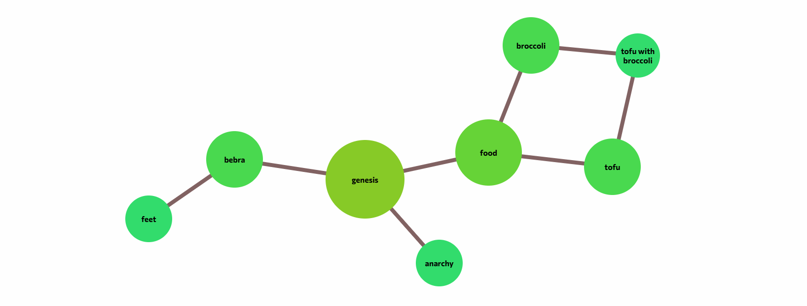

# graph.mjs
Module for creating smart graphs

## Example

### JavaScript
```js
import("/js/modules/graph.mjs").then((graph) => {
  // Imported the graph.mjs module

  // Initializing the graph instance
  const instance = new graph.core(document.getElementById('graph'));
    
  // Writing settings of the graph instance
  instance.living = 3000;
  instance.camera = true;
  instance.operate = true;
    
  // Initializing and registering nodes
  const genesis = instance.node(new graph.node(document.getElementById('genesis')));
  const food = instance.node(new graph.node(document.getElementById('food')));
  const tofu = instance.node(new graph.node(document.getElementById('tofu')));
  const broccoli = instance.node(new graph.node(document.getElementById('broccoli')));
  const wtf = instance.node(new graph.node(document.getElementById('wtf')));
  const bebra = instance.node(new graph.node(document.getElementById('bebra')));
  const feet = instance.node(new graph.node(document.getElementById('feet')));
  const anarchy = instance.node(new graph.node(document.getElementById('anarchy')));
    
  // Writing settings for every node
  instance.nodes.forEach((node) => { node.variables.get("inputs").type = "deg" });
    
  // Initializing and registering edges
  instance.edge(new graph.edge(feet, bebra));
  instance.edge(new graph.edge(bebra, genesis));
  instance.edge(new graph.edge(anarchy, genesis));
  instance.edge(new graph.edge(food, genesis));
  instance.edge(new graph.edge(tofu, food));
  instance.edge(new graph.edge(broccoli, food));
  instance.edge(new graph.edge(wtf, tofu));
  instance.edge(new graph.edge(wtf, broccoli));
});
```

### HTML
```html
<section id='graph'>
  <article id="genesis" class="node unselectable"><a>genesis</a></article>
  <article id="food" class="node unselectable"><a>food</a></article>
  <article id="tofu" class="node unselectable"><a>tofu</a></article>
  <article id="broccoli" class="node unselectable"><a>broccoli</a></article>
  <article id="wtf" class="node unselectable"><a>tofu with broccoli</a></article>
  <article id="bebra" class="node unselectable"><a>bebra</a></article>
  <article id="feet" class="node unselectable"><a>feet</a></article>
  <article id="anarchy" class="node unselectable"><a>anarchy</a></article>
</section>
```

### CSS
```css
@keyframes node-movement {
  0% {
    left: var(--graph-node-from-left);
    top: var(--graph-node-from-top);
  }

  100% {
    left: var(--graph-node-to-left);
    top: var(--graph-node-to-top);
  }
}

.unselectable {
  -webkit-touch-callout: none;
  -webkit-user-select: none;
  -khtml-user-select: none;
  -moz-user-select: none;
  -ms-user-select: none;
  user-select: none;
}

body {
  height: 100vh;
  margin: 0;
  overflow: hidden;
}

body:active {
  cursor: move;
}

section#graph {
  left: var(--graph-shell-left);
  top: var(--graph-shell-top);
  width: 100vw;
  height: 100vh;
  position: absolute;
}

article.node {
  z-index: calc(500 + var(--graph-node-layer, 0) - var(--graph-node-inputs, 0));
  left: var(--graph-node-from-left, var(--graph-node-left));
  top: var(--graph-node-from-top, var(--graph-node-top));
  width: var(--graph-node-augmented, 100px);
  height: var(--graph-node-augmented, 100px);
  position: absolute;
  display: flex;
  cursor: grab;
  border-radius: 100%;
  background-color: #33dd6d;
  filter: hue-rotate(calc(0deg + var(--graph-node-inputs) * -15));
}

article.node.movement {
  animation-name: node-movement;
  animation-fill-mode: forwards;
  animation-duration: 0.6s;
/*   animation-duration: 5.5s; */
  animation-timing-function: cubic-bezier(0, 1, 1, 1);
}

article.node:active {
  cursor: grabbing;
}

article.node > a:first-of-type {
  margin: auto;
  text-align: center;
  text-decoration: unset;
  font-weight: bold;
  cursor: pointer;
  color: black;
}

svg.edge {
  z-index: -500;
  position: absolute;
  width: 100%;
  height: 100%;
}

svg.edge > line {
  stroke: #816262;
  stroke-width: 8px;
}
```

### Result
<br><br>
[Try it on CodePen](https://codepen.io/mirzaev-sexy/pen/Rwyxprz)